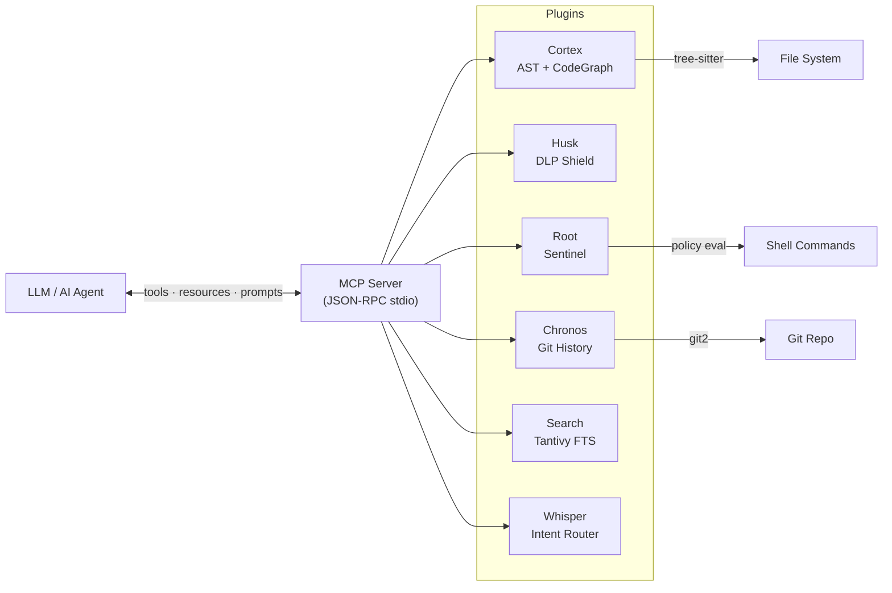

# SYNAPSEED

**Pure Rust Semantic AI Middleware — The Thinking Layer Between You and Your LLM.**

[](https://github.com/fabriziosalmi/synapseed/actions)
[](https://opensource.org/licenses/MIT)
[](https://www.rust-lang.org/)
[](https://modelcontextprotocol.io/)

---

Most AI coding agents treat your codebase as flat text — `grep` for search, `cat` for reading, zero security. This leads to hallucinations, broken imports, and leaked secrets.

**SYNAPSEED** parses code into an **AST**, indexes it semantically, scans for secrets in real-time, tracks git history with semantic tags, compiles in the background, analyzes architecture health, and visualizes everything live — all in a **single Rust binary** with **zero network calls**.

| Capability | Standard LLM Context | SYNAPSEED |
| :--- | :--- | :--- |
| Code access | `cat file.rs` (blind text) | AST skeleton with symbols and relationships |
| Search | Regex / grep | Tantivy FTS + vector embedding similarity |
| Security | None (leaked secrets) | DLP fail-closed with real-time redaction |
| Context | Zero (stateless) | Git time-travel + session continuity |
| Safety | Suggests `rm -rf /` | Command sentinel + Janitor dry-run default |
| Architecture | None | Dependency graph, coupling metrics, cycle detection |
| Visibility | None | Live graph + X-Ray Mode (Shift+hover) |
| Observability | None | OTLP telemetry receiver with heatmap |
| Startup | Blocks until indexed | Background indexing, port-hopping |
| Latency | High (network calls) | Zero-copy direct Rust (<10 ms) |

---

## Quick Start

```bash
git clone https://github.com/fabriziosalmi/synapseed.git
cd synapseed
cargo install --path bin/synapseed --force
synapseed --version
```

**Prerequisites:** Rust 1.75+, Git.

---

## Integration

### Claude Desktop

Add to `~/Library/Application Support/Claude/claude_desktop_config.json` (macOS) or `%APPDATA%\Claude\claude_desktop_config.json` (Windows):

```json
{
  "mcpServers": {
    "synapseed": {
      "command": "synapseed",
      "args": ["serve", "--project", "/path/to/your/project"],
      "env": { "RUST_LOG": "warn" }
    }
  }
}
```

### Claude Code

Add to `~/.claude/settings.json` or `.mcp.json` in your project root:

```json
{
  "mcpServers": {
    "synapseed": {
      "command": "synapseed",
      "args": ["serve", "--project", "."],
      "env": { "RUST_LOG": "warn" }
    }
  }
}
```

### VS Code / Cursor / Copilot

Add to `.vscode/mcp.json`:

```json
{
  "servers": {
    "synapseed": {
      "command": "synapseed",
      "args": ["serve", "--project", "${workspaceFolder}"],
      "env": { "RUST_LOG": "warn" }
    }
  }
}
```

See the [full integration guides](docs/integration/) for system prompt templates and advanced configuration.

---

## Architecture

```
┌──────────────────────────────────────────────────────────────────────┐
│                        MCP JSON-RPC (stdio)                          │
├──────────────────────────────────────────────────────────────────────┤
│                                                                      │
│  ┌─────────┐  ┌──────┐  ┌──────┐  ┌─────────┐  ┌───────┐  ┌─────┐ │
│  │ Cortex  │  │ Husk │  │ Root │  │ Chronos │  │Search │  │ Gym │ │
│  │  (AST)  │  │(DLP) │  │(Cmd) │  │  (Git)  │  │(FTS)  │  │(RL) │ │
│  └────┬────┘  └──┬───┘  └──┬───┘  └────┬────┘  └───┬───┘  └──┬──┘ │
│       │          │         │            │           │          │     │
│  ┌────┴──────────┴─────────┴────────────┴───────────┴──────────┴──┐ │
│  │                SynapseContext (Event Bus + Sessions)            │ │
│  └────┬──────────┬─────────┬────────────┬──────────┬──────────┬───┘ │
│       │          │         │            │          │          │      │
│  ┌────┴────┐  ┌──┴───┐  ┌─┴──────┐  ┌──┴──┐  ┌───┴────┐  ┌─┴───┐ │
│  │ Shadow  │  │Whis- │  │Visuali-│  │Tele-│  │Janitor │  │Arch-│ │
│  │(Compile)│  │ per  │  │  zer   │  │metry│  │(Maint.)│  │itect│ │
│  └─────────┘  └──────┘  └────────┘  └─────┘  └────────┘  └─────┘ │
│                                                                      │
└──────────────────────────────────────────────────────────────────────┘
   15 crates · Plugin architecture · Priority-based init · HCI-tuned
```



| Crate | Role |
| :--- | :--- |
| `synapseed-core` | Event bus, plugin trait, context, session persistence, HCI config |
| `synapseed-cortex` | Tree-sitter AST (Rust/Python/JS + 27 fallback), background indexing |
| `synapseed-husk` | DLP shield — Aho-Corasick + regex secret detection |
| `synapseed-root` | Command sentinel — policy-based command evaluation |
| `synapseed-chronos` | Git history with semantic commit tags and intent analysis |
| `synapseed-search` | Tantivy FTS + local vector embeddings (fastembed, cosine similarity) |
| `synapseed-shadow-check` | Background `cargo check` with severity filtering and adaptive debounce |
| `synapseed-visualizer` | Live Cytoscape.js dashboard with X-Ray Mode and port-hopping |
| `synapseed-whisper` | Intent router with query complexity analysis (Mentor Mode) |
| `synapseed-telemetry-sink` | OTLP gRPC receiver on port 4317, SpanStore, heatmap |
| `synapseed-gym` | RL sandbox — safe code evaluation with compilation + test feedback |
| `synapseed-janitor` | Autonomous maintenance — clippy + unused deps, validated proposals |
| `synapseed-architect` | Dependency graph, coupling metrics, cycle detection, scoring (A-F) |
| `synapseed-mcp` | MCP protocol handler — 19 tools, 8 resources, 6 prompts |

---

## MCP Tools (19)

| Tool | Tier | Description |
| :--- | :--- | :--- |
| `ask_synapseed` | PRIMARY | Intent-based orchestration — start here for any question |
| `get_code_skeleton` | LOW-LEVEL | Parse project AST and return symbol graph |
| `lookup_symbol` | LOW-LEVEL | Find function/struct/trait by name |
| `semantic_search` | LOW-LEVEL | Concept-based code search via Tantivy |
| `scan_security` | LOW-LEVEL | DLP scan for secrets (API keys, passwords, private keys) |
| `check_command` | LOW-LEVEL | Evaluate shell command against security policy |
| `git_history` | LOW-LEVEL | Semantic git blame and file history |
| `analyze_history` | LOW-LEVEL | Churn analysis, risk scoring, change patterns |
| `git_intent_summary` | LOW-LEVEL | Summarize recent commit intent by category |
| `get_diagnostics` | LOW-LEVEL | Live compiler errors and warnings |
| `apply_quick_fix` | LOW-LEVEL | Auto-apply compiler-suggested fixes |
| `consult_architect` | LOW-LEVEL | Architecture guidance from project DNA config |
| `project_diagnose` | LOW-LEVEL | Full system diagnostic across all subsystems |
| `reset_telemetry` | LOW-LEVEL | Clear telemetry span store and metrics |
| `train_code` | SPECIALIZED | Evaluate Rust code in isolated sandbox (The Gym) |
| `janitor_run_now` | SPECIALIZED | Scan for clippy warnings and unused deps |
| `janitor_apply_fix` | SPECIALIZED | Apply a Janitor fix (dry-run preview by default) |
| `architect_analyze` | SPECIALIZED | Structural health analysis (score, cycles, coupling) |
| `semantic_similarity` | SPECIALIZED | Vector embedding similarity search |

## MCP Resources (8)

| URI | Description |
| :--- | :--- |
| `synapseed://status` | Project status (state, metrics, plugins) |
| `synapseed://dna` | Project DNA configuration |
| `synapseed://security/policy` | Active security policy rules |
| `synapseed://diagnostics/active` | Current compiler diagnostics |
| `synapseed://visualizer/url` | Visualizer dashboard URL |
| `synapseed://telemetry/hotspots` | Top-10 performance hotspots from OTLP spans |
| `synapseed://janitor/proposals` | Janitor fix proposals |
| `synapseed://architect/health` | Architecture health score and violations |

## MCP Prompts (6)

- **`onboard_project`** — Generate a comprehensive project onboarding guide
- **`security_audit`** — Deep security audit across DLP, commands, and architecture
- **`refactor_module`** — Analyze and plan a module refactoring
- **`debug_error`** — Systematic error debugging with compiler + history context
- **`architecture_review`** — Full architecture review with risk assessment
- **`optimize_hotspots`** — Analyze telemetry hotspots and suggest optimizations

---

## CLI Commands

```bash
synapseed serve --project .          # Start MCP server (stdio)
synapseed hoist --project .          # Index project and print AST skeleton
synapseed lookup <name> --project .  # Find symbol by name across the project
synapseed scan --text "secret_key=..." # DLP scan for sensitive data
synapseed check "cargo test"         # Evaluate command against security policy
synapseed history --limit 20         # Git history with semantic commit tags
synapseed blame <file> -s 1 -e 30   # Git blame for file line range
synapseed diagnose --project .       # Full system diagnostic
synapseed status --project .         # Runtime metrics and system status
synapseed init --project .           # Initialize all plugins and broadcast event
```

---

## Self-Telemetry (Dogfooding)

SYNAPSEED can observe its own performance by sending tracing spans to its own OTLP receiver:

```bash
SYNAPSEED_SELF_TELEMETRY=1 synapseed serve --project .
```

This enables a feedback loop: SYNAPSEED operations emit spans via `BatchSpanProcessor` to `localhost:4317`, where the TelemetrySink ingests them into SpanStore. The Visualizer then colors nodes by latency — red for hot, yellow for warm, green for cool.

---

## Configuration

Create `.synapseed/dna.yaml` in your project root (or `~/.config/synapseed/dna.yaml` for user-level defaults):

```yaml
workspace_strategy: monorepo

naming:
  core_crate: core
  bin_name: my-app

preferred_libs:
  async: tokio
  json: serde_json
  error: thiserror
  http: axum

plugins:
  - cortex
  - husk
  - root
  - chronos
  - search
  - visualizer
  - shadow
  - whisper
  - telemetry

dlp_level: standard          # off | low | standard | strict | paranoid
visualizer_port: 3000        # override with SYNAPSEED_VISUALIZER_PORT env var

hci:
  background_indexing: true   # Non-blocking startup (Cortex indexes in background)
  port_retry: true            # Visualizer auto-retries next port if taken
  adaptive_linting: true      # Shadow-check debounce escalates during rapid edits
  mentor_mode: true           # Response depth adapts to query complexity
  session_persistence: true   # Resume context across MCP restarts
  memory_ceiling_files: 10000 # Cap indexed files to limit memory usage
```

All fields are optional — omitted fields use sensible defaults. Project-level config overrides user-level config. See [`examples/dna.yaml`](examples/dna.yaml) for a full annotated example.

### Search Index

By default, the Tantivy search index runs **in-memory** (RAM-only) for instant startup. On large codebases, enable disk persistence to avoid re-indexing on every MCP server restart:

```yaml
# .synapseed/dna.yaml
search:
  persistence: true  # persists index to .synapseed/index/
```

### Environment Variables

| Variable | Default | Description |
| :--- | :--- | :--- |
| `RUST_LOG` | `info` | Log level filter |
| `SYNAPSEED_LOG_FORMAT` | `compact` | Log format (`compact` or `json`) |
| `SYNAPSEED_SELF_TELEMETRY` | `0` | Enable self-instrumentation (`1` to enable) |
| `SYNAPSEED_VISUALIZER_PORT` | `3000` | Override visualizer dashboard port |

---

## Security

SYNAPSEED enforces a **defense-in-depth, fail-closed** security model:

1. **DLP Shield (Husk)** — Aho-Corasick + regex scanning blocks API keys, passwords, private keys, and PII from ever reaching the LLM
2. **Command Sentinel (Root)** — Deny-first policy evaluation blocks destructive commands
3. **Network Isolation** — All servers bind to `127.0.0.1` only, zero outbound calls
4. **Process Boundary** — No arbitrary subprocess spawning, read-only AST analysis

### Custom Security Rules

Add custom DLP rules in `.synapseed/dna.yaml`:

```yaml
dlp_level: strict

dlp_custom_rules:
  - name: internal_api_key
    pattern: "INTERNAL-[A-Z0-9]{16}"
    action: redact
  - name: corporate_email
    pattern: "\\b[\\w.]+@corp\\.example\\.com\\b"
    action: audit
```

Rule actions: `redact` (replace with `[REDACTED]`), `deny` (block entirely), `audit` (log only), `allow` (skip).

The Sentinel uses a **deny-first** model: any command matching a deny rule is blocked regardless of allow rules. Default deny list includes `rm -rf`, `curl | sh`, `chmod 777`, `mkfs`, and other destructive patterns.

---

## Documentation

Full documentation is available in the [docs/](docs/) directory, built with VitePress:

```bash
cd docs
npm install
npm run dev
# Open http://localhost:5173
```

Sections: [Guide](docs/guide/) · [Architecture](docs/architecture/) · [Features](docs/features/) · [MCP Reference](docs/reference/) · [Integration](docs/integration/) · [Security](docs/security/)

---

## Contributing

1. Fork the repo
2. Create your feature branch (`git checkout -b feature/amazing-feature`)
3. Commit your changes (`git commit -m 'Add some amazing feature'`)
4. Push to the branch (`git push origin feature/amazing-feature`)
5. Open a Pull Request

---

## License

Distributed under the MIT License. See `LICENSE` for more information.

---

**Built with Rust by [Fabrizio Salmi](https://github.com/fabriziosalmi)**
