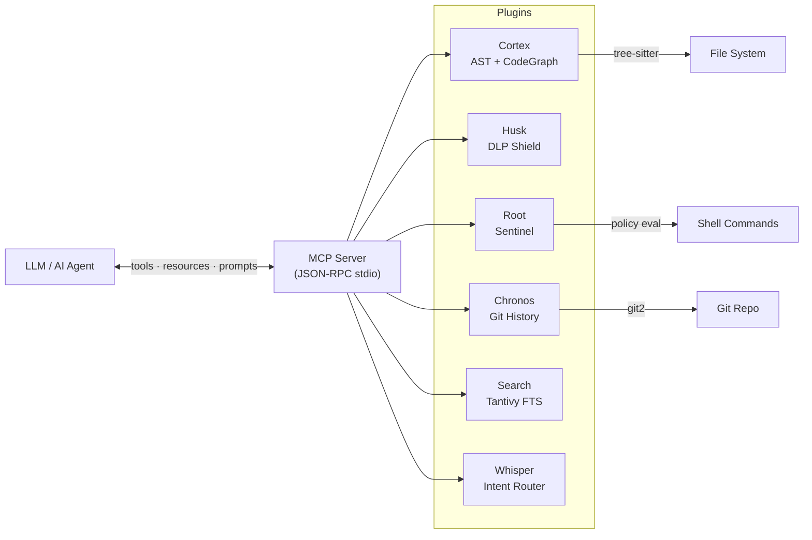

# SYNAPSEED

**Pure Rust MCP server for semantic code search, AST analysis, and security scanning.**

[](https://github.com/fabriziosalmi/synapseed/actions)
[](https://codecov.io/gh/fabriziosalmi/synapseed)
[](https://opensource.org/licenses/Apache-2.0)
[](https://www.rust-lang.org/)
[](https://modelcontextprotocol.io/)

---

SYNAPSEED provides AST-based code understanding, Tantivy full-text search, DLP secret scanning, git history analysis, background compilation diagnostics, and architecture health scoring — exposed as 24 MCP tools in a single Rust binary with zero network calls.

| Feature | Description |
| :--- | :--- |
| Code access | Tree-sitter AST with symbol graph and relationships |
| Search | Tantivy FTS (BM25 + prefix + fuzzy) and vector embedding similarity |
| Security | DLP secret scanning (Aho-Corasick + regex), command sentinel (deny-first) |
| Git context | Semantic commit classification, blame attribution, churn analysis |
| Diagnostics | Background `cargo check` with severity filtering |
| Architecture | Dependency graph, coupling metrics, cycle detection, A-F scoring |
| Observability | OTLP telemetry receiver with span store and heatmap |

---

## Quick Start

```bash
git clone https://github.com/fabriziosalmi/synapseed.git
cd synapseed
cargo install --path bin/synapseed --force
synapseed --version
```

**Prerequisites:** Rust 1.75+, Git.

---

## Integration

### Claude Desktop

Add to `~/Library/Application Support/Claude/claude_desktop_config.json` (macOS) or `%APPDATA%\Claude\claude_desktop_config.json` (Windows):

```json
{
  "mcpServers": {
    "synapseed": {
      "command": "synapseed",
      "args": ["serve", "--project", "/path/to/your/project"],
      "env": { "RUST_LOG": "warn" }
    }
  }
}
```

### Claude Code

Add to `~/.claude/settings.json` or `.mcp.json` in your project root:

```json
{
  "mcpServers": {
    "synapseed": {
      "command": "synapseed",
      "args": ["serve", "--project", "."],
      "env": { "RUST_LOG": "warn" }
    }
  }
}
```

### VS Code / Cursor / Copilot

Add to `.vscode/mcp.json`:

```json
{
  "servers": {
    "synapseed": {
      "command": "synapseed",
      "args": ["serve", "--project", "${workspaceFolder}"],
      "env": { "RUST_LOG": "warn" }
    }
  }
}
```

See the [full integration guides](docs/integration/) for system prompt templates and advanced configuration.

### VS Code Extension

Install the SYNAPSEED extension for real-time metrics, diagnostics, and architecture health directly in the VS Code sidebar.

```bash
cd vscode-extension
npm install && npm run package
code --install-extension synapseed-0.4.0.vsix
```

Features: 5 sidebar panels (Overview, Diagnostics, Code Quality, Security, Git), Dashboard webview, Benchmark Results viewer, Ask panel, auto-refresh on save, status bar integration, CodeLens with churn risk, file decorations with instability badges. All webviews use CSP nonce security, structured logging via dedicated Output Channel, workspace trust gating. See the [extension README](vscode-extension/README.md) for details.

---

## Architecture

```
┌──────────────────────────────────────────────────────────────────────┐
│                        MCP JSON-RPC (stdio)                          │
├──────────────────────────────────────────────────────────────────────┤
│                                                                      │
│  ┌─────────┐  ┌──────┐  ┌──────┐  ┌─────────┐  ┌───────┐  ┌─────┐ │
│  │ Cortex  │  │ Husk │  │ Root │  │ Chronos │  │Search │  │ Gym │ │
│  │  (AST)  │  │(DLP) │  │(Cmd) │  │  (Git)  │  │(FTS)  │  │(RL) │ │
│  └────┬────┘  └──┬───┘  └──┬───┘  └────┬────┘  └───┬───┘  └──┬──┘ │
│       │          │         │            │           │          │     │
│  ┌────┴──────────┴─────────┴────────────┴───────────┴──────────┴──┐ │
│  │                SynapseContext (Event Bus + Sessions)            │ │
│  └────┬──────────┬─────────┬────────────┬──────────┬──────────┬───┘ │
│       │          │         │            │          │          │      │
│  ┌────┴────┐  ┌──┴───┐  ┌──┴──┐  ┌───┴────┐  ┌─┴───┐              │
│  │ Shadow  │  │Whis- │  │Tele-│  │Janitor │  │Arch-│              │
│  │(Compile)│  │ per  │  │metry│  │(Maint.)│  │itect│              │
│  └─────────┘  └──────┘  └─────┘  └────────┘  └─────┘              │
│                                                                      │
└──────────────────────────────────────────────────────────────────────┘
   16 crates · Plugin architecture · Priority-based init · HCI-tuned
```



| Crate | Role |
| :--- | :--- |
| `synapseed-core` | Event bus, plugin trait, context, session persistence, HCI config |
| `synapseed-cortex` | Tree-sitter AST (Rust/Python/JS + 27 fallback), background indexing |
| `synapseed-husk` | DLP shield — Aho-Corasick + regex secret detection + entropy-gated encoding |
| `synapseed-root` | Command sentinel — policy-based command evaluation |
| `synapseed-chronos` | Git history with semantic commit tags, intent analysis, AI attribution tracking |
| `synapseed-search` | Tantivy FTS + prefix matching + vector embeddings (fastembed, cosine) |
| `synapseed-shadow-check` | Background `cargo check` with severity filtering and adaptive debounce |
| `synapseed-whisper` | Intent router — multi-intent classification, parallel gather, score-aware context |
| `synapseed-telemetry-sink` | OTLP gRPC receiver on port 4317, SpanStore, heatmap |
| `synapseed-gym` | RL sandbox — safe code evaluation with compilation + test feedback |
| `synapseed-janitor` | Autonomous maintenance — clippy + unused deps, validated proposals |
| `synapseed-architect` | Dependency graph, coupling metrics, cycle detection, scoring (A-F) |
| `synapseed-decompiler` | Neural Decompiler — ELF/Mach-O/PE binary analysis, symbol extraction, behavioral inference |
| `synapseed-bench` | Benchmark engine — reproducible SCR evaluation with JSONL question suites |
| `synapseed-mcp` | MCP protocol handler — 25 tools, 13 resources, 6 prompts |

### Benchmark Suite

The `benchmark/` directory contains a comprehensive evaluation framework that measures SYNAPSEED's grounding impact across models:

- **Coding** — 9 tasks (easy/medium/hard) with 6 ablation conditions (blind, synapseed, +opt, nothink)
- **Grounding** — Fact extraction with blind vs grounded comparison
- **Search** — MRR, Precision@K, Recall@K evaluation
- **NIAH** — Needle-in-a-haystack retrieval tests

All limits are removed by design — no `max_tokens` cap, 15-minute per-call timeout, dynamic per-task budgets. Models get the space they need to think and answer.

```bash
cd benchmark && source venv/bin/activate
python run.py coding --model qwen/qwen3-4b --modes all
python run.py grounding --quick
python run.py search
```

Results are saved as JSON in `benchmark/results/` and can be visualized in the VS Code extension's Benchmark Results panel.

### Model Tier — Context Budgeting (v5.0)

SYNAPSEED adapts context injection to the downstream model's capacity. All budgets derive from a single `token_budget()` parameter:

| Tier | Model Size | Token Budget | Strategy | Max Targets | Max Clusters |
| :--- | :--- | :--- | :--- | :--- | :--- |
| **Atomic** | < 1B | 2K | Chirurgica — exact symbol only | 2 | 1 |
| **Molecular** | 1B–4B | 8K | Relazionale — 2-3 file links | 5 | 2 |
| **Galactic** | 4B–14B | 16K | Architetturale — full modules | 10 | 3 |
| **Universal** | >14B / Cloud | 32K+ | Olistica — massive synthesis | 15 | 5 |

The **80% Rule** reserves 20% headroom for the system prompt and user query. Configure via `hci.model_profile` in `dna.yaml` or auto-detected from the MCP client name.

---

## MCP Tools (25)

| Tool | Tier | CLI Alias | Description |
| :--- | :--- | :--- | :--- |
| `ask` | PRIMARY | `ask_synapseed`, `whisper` | Intent-based orchestration — start here for any question |
| `hoist` | LOW-LEVEL | `get_code_skeleton` | Parse project AST and return symbol graph |
| `lookup` | LOW-LEVEL | `lookup_symbol` | Find function/struct/trait by name |
| `search` | LOW-LEVEL | `semantic_search` | Concept-based code search via Tantivy |
| `scan` | LOW-LEVEL | `scan_security` | DLP scan for secrets (API keys, passwords, private keys) |
| `check` | LOW-LEVEL | `check_command` | Evaluate shell command against security policy |
| `blame` | LOW-LEVEL | `git_history` | Semantic git blame and file history |
| `analyze` | LOW-LEVEL | `analyze_history` | Churn analysis, risk scoring, change patterns |
| `intent` | LOW-LEVEL | `git_intent_summary` | Summarize recent commit intent by category |
| `diagnostics` | LOW-LEVEL | `get_diagnostics` | Live compiler errors and warnings |
| `quickfix` | LOW-LEVEL | `apply_quick_fix` | Auto-apply compiler-suggested fixes |
| `consult` | LOW-LEVEL | `consult_architect` | Architecture guidance from project DNA config |
| `diagnose` | LOW-LEVEL | `project_diagnose` | Full system diagnostic across all subsystems |
| `reset-telemetry` | LOW-LEVEL | `reset_telemetry` | Clear telemetry span store and metrics |
| `train` | SPECIALIZED | `train_code` | Evaluate Rust code in isolated sandbox (The Gym) |
| `janitor` | SPECIALIZED | `janitor_run_now` | Scan for clippy warnings and unused deps |
| `janitor-fix` | SPECIALIZED | `janitor_apply_fix` | Apply a Janitor fix (dry-run preview by default) |
| `approve-fix` | SPECIALIZED | `approve_fix` | Apply a RepairOrchestrator auto-fix proposal (dry-run preview by default) |
| `architect` | SPECIALIZED | `architect_analyze` | Structural health analysis (score, cycles, coupling) |
| `oracle` | SPECIALIZED | `oracle_fix_docs` | Auto-repair drifted documentation (version, counts) |
| `similar` | SPECIALIZED | `semantic_similarity` | Vector embedding similarity search |
| `verify_path` | LOW-LEVEL | `verify_path` | Verify file path exists (prevents LLM hallucination) |
| `analyze_binary` | SPECIALIZED | `neural_decompiler` | Analyze ELF/Mach-O/PE binaries (symbols, strings, call graph) |
| `explain_dependency` | SPECIALIZED | — | Explain a compiled Rust dependency by binary analysis |
| `run_benchmark` | SPECIALIZED | `benchmark` | Run reproducible SCR evaluation suite (F1, SID, hallucination rate) |

## MCP Resources (13)

| URI | Description |
| :--- | :--- |
| `synapseed://status` | Project status (state, metrics, plugins) |
| `synapseed://dna` | Project DNA configuration |
| `synapseed://security/policy` | Active security policy rules |
| `synapseed://diagnostics/active` | Current compiler diagnostics |
| `synapseed://pipeline/metrics` | Pipeline metrics (ingest throughput, enrichment stats) |
| `synapseed://telemetry/hotspots` | Top-10 performance hotspots from OTLP spans |
| `synapseed://janitor/proposals` | Janitor fix proposals |
| `synapseed://architect/health` | Architecture health score and violations |
| `synapseed://consistency` | Consistency Oracle report (drift detection) |
| `synapseed://session/recorder` | Flight Recorder — session memory with working set and journey map |
| `synapseed://session/context` | Cognitive Ledger — deterministic Operational Moment classification and session pulse |
| `synapseed://context/active` | Dynamic project briefing (preload for instant situational awareness) |
| `synapseed://pulse` | Pulse activity counters — exponential-decay working set (files & symbols) |

## MCP Prompts (5)

- **`describe_architecture`** — Analyze and describe the project architecture using semantic understanding
- **`fix_build_errors`** — Diagnose and fix current build errors using the shadow compiler
- **`explain_evolution`** — Trace code evolution through git history, churn analysis, and co-change patterns
- **`security_audit`** — Comprehensive security audit across DLP, commands, and git history
- **`optimize_hotspots`** — Analyze runtime performance hotspots from OTLP telemetry data

---

## CLI Commands

Every MCP tool is available as a CLI command. Legacy MCP names (e.g. `ask_synapseed`, `get_code_skeleton`) are accepted as visible aliases. Unrecognized input is treated as an `ask` query.

```bash
# ── Quick Ask (default fallback) ──
synapseed "why is login broken?"     # Shorthand for: synapseed ask "..."

# ── Server & System ──
synapseed serve --project .          # Start MCP server (stdio)
synapseed init --project .           # Initialize all plugins and broadcast event
synapseed status --project .         # Runtime metrics and system status
synapseed diagnose --project .       # Full system diagnostic

# ── Code Analysis ──
synapseed hoist                      # Index project and print AST skeleton
synapseed hoist src/                 # Index a specific subdirectory
synapseed lookup <name> --project .  # Find symbol by name across the project
synapseed search "auth login" -l 10  # Semantic search via Tantivy
synapseed similar "error handling"   # Vector embedding similarity search
synapseed ask "why is login broken?" # Ask SYNAPSEED (orchestrates everything)

# ── Security ──
synapseed scan -c "secret=..."       # DLP scan for sensitive data
synapseed scan --content "..." -m dlp  # DLP-only scan mode
echo "data" | synapseed scan         # Scan from stdin
synapseed check "cargo test"         # Evaluate command against security policy

# ── Git ──
synapseed history --limit 20         # Git history with semantic commit tags
synapseed blame <file> -s 1 -e 30   # Git blame for file line range
synapseed analyze <file>             # Churn analysis, hotspots, risk scoring
synapseed intent --limit 10          # Semantic commit intent summary

# ── Compiler & Maintenance ──
synapseed diagnostics                # Live compiler errors and warnings
synapseed quickfix <file> <code>     # Auto-apply compiler-suggested fix
synapseed janitor                    # Scan clippy warnings + unused deps
synapseed janitor-fix <id> --confirm # Apply a janitor fix proposal

# ── Architecture ──
synapseed architect --refresh        # Structural health analysis (A-F score)
synapseed consult "which runtime?"   # Consult architecture policy (DNA)
synapseed oracle                     # Auto-repair drifted documentation

# ── Sandbox ──
synapseed train src.rs --adversarial # Evaluate Rust code in the Gym sandbox
synapseed reset-telemetry            # Clear OTLP telemetry data
```

---

## Self-Telemetry (Dogfooding)

SYNAPSEED can observe its own performance by sending tracing spans to its own OTLP receiver:

```bash
SYNAPSEED_SELF_TELEMETRY=1 synapseed serve --project .
```

This enables a feedback loop: SYNAPSEED operations emit spans via `BatchSpanProcessor` to `localhost:4317`, where the TelemetrySink ingests them into SpanStore. Query the `synapseed://telemetry/hotspots` resource to identify performance bottlenecks.

---

## Configuration

Create `.synapseed/dna.yaml` in your project root (or `~/.config/synapseed/dna.yaml` for user-level defaults):

```yaml
workspace_strategy: monorepo

naming:
  core_crate: core
  bin_name: my-app

preferred_libs:
  async: tokio
  json: serde_json
  error: thiserror
  http: axum

plugins:
  - cortex
  - husk
  - root
  - chronos
  - search
  - shadow
  - whisper
  - telemetry

dlp_level: standard          # off | low | standard | strict | paranoid

hci:
  background_indexing: true   # Non-blocking startup (Cortex indexes in background)
  adaptive_linting: true      # Shadow-check debounce escalates during rapid edits
  mentor_mode: true           # Response depth adapts to query complexity
  session_persistence: true   # Resume context across MCP restarts
  memory_ceiling_files: 10000 # Cap indexed files to limit memory usage
```

All fields are optional — omitted fields use sensible defaults. Project-level config overrides user-level config. See [`examples/dna.yaml`](examples/dna.yaml) for a full annotated example.

### Search Index

By default, the Tantivy search index runs **in-memory** (RAM-only) for instant startup. On large codebases, enable disk persistence to avoid re-indexing on every MCP server restart:

```yaml
# .synapseed/dna.yaml
search:
  persistence: true  # persists index to .synapseed/index/
```

### Environment Variables

| Variable | Default | Description |
| :--- | :--- | :--- |
| `RUST_LOG` | `info` | Log level filter |
| `SYNAPSEED_LOG_FORMAT` | `compact` | Log format (`compact` or `json`) |
| `SYNAPSEED_SELF_TELEMETRY` | `0` | Enable self-instrumentation (`1` to enable) |

---

## Security

SYNAPSEED enforces a **defense-in-depth, fail-closed** security model:

1. **DLP Shield (Husk)** — Aho-Corasick + regex scanning blocks API keys, passwords, private keys, and PII from ever reaching the LLM
2. **Command Sentinel (Root)** — Deny-first policy with shell chaining defense (splits on `;`, `|`, `&&`, `||`, newlines), null byte rejection, and deny rules for command substitution, base64 obfuscation, and interpreter inline execution
3. **Network Isolation** — All servers bind to `127.0.0.1` only, zero outbound calls
4. **Process Boundary** — No arbitrary subprocess spawning, read-only AST analysis

### Custom Security Rules

Add custom DLP rules in `.synapseed/dna.yaml`:

```yaml
dlp_level: strict

dlp_custom_rules:
  - name: internal_api_key
    pattern: "INTERNAL-[A-Z0-9]{16}"
    action: redact
  - name: corporate_email
    pattern: "\\b[\\w.]+@corp\\.example\\.com\\b"
    action: audit
```

Rule actions: `redact` (replace with `[REDACTED]`), `deny` (block entirely), `audit` (log only), `allow` (skip).

### DLP Whitelist

Suppress false-positive DLP findings with regex patterns in `.synapseed/dna.yaml`:

```yaml
dlp_whitelist:
  - "(?i)token\\s*[:=]\\s*[A-Z]\\w+"   # CancellationToken, etc.
  - "(?i)shutdown_token"                 # Rust async shutdown pattern
```

Built-in defaults already suppress `CancellationToken` and `shutdown_token` patterns common in Rust codebases.

The Sentinel uses a **deny-first** model with shell chaining defense: commands are split on shell operators (`;`, `|`, `&&`, `||`) and each segment is evaluated independently. Default deny list includes `rm -rf`, `curl | sh`, `chmod 777/0777/a+rwx`, `mkfs`, `$()`, backticks, `base64 -d`, interpreter `-c`/`-e`, `nohup`, and `LD_PRELOAD`.

---

## Documentation

Full documentation is available in the [docs/](docs/) directory, built with VitePress:

```bash
cd docs
npm install
npm run dev
# Open http://localhost:5173
```

Sections: [Guide](docs/guide/) · [Architecture](docs/architecture/) · [Features](docs/features/) · [MCP Reference](docs/reference/) · [Integration](docs/integration/) · [Security](docs/security/)

---

## Contributing

1. Fork the repo
2. Create your feature branch (`git checkout -b feature/amazing-feature`)
3. Commit your changes (`git commit -m 'Add some amazing feature'`)
4. Push to the branch (`git push origin feature/amazing-feature`)
5. Open a Pull Request

---

## License

Distributed under the Apache License 2.0. See `LICENSE` for more information.

---

**Built with Rust by [Fabrizio Salmi](https://github.com/fabriziosalmi)**
