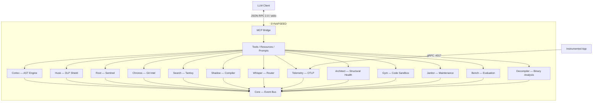

# Architecture Overview

SYNAPSEED is built as a **Modular Monolith** — a single binary composed of independent crates with strict boundaries, connected through a shared event bus and plugin architecture.

## High-Level Diagram



## Data Flow

1. **LLM sends a tool call** via MCP (JSON-RPC 2.0 over stdin)
2. **MCP bridge** deserializes and routes to the appropriate handler
3. **Tool handler** invokes one or more subsystems (e.g., Cortex for indexing, Husk for scanning)
4. **Subsystems** read/write to the shared `SynapseContext` and broadcast events
5. **Response** is serialized back to the LLM via stdout
6. **Side effects** (telemetry collection) happen asynchronously via the event bus

## Crate Dependency Graph

```
synapseed-cli (binary)
├── synapseed-mcp
│   ├── synapseed-core
│   ├── synapseed-cortex → synapseed-core
│   ├── synapseed-husk → synapseed-core
│   ├── synapseed-root → synapseed-core, synapseed-husk
│   ├── synapseed-chronos → synapseed-core
│   ├── synapseed-search → synapseed-core, synapseed-cortex
│   ├── synapseed-shadow-check → synapseed-core
│   ├── synapseed-architect → synapseed-core, synapseed-cortex
│   ├── synapseed-gym → synapseed-core
│   ├── synapseed-janitor → synapseed-core
│   ├── synapseed-bench → synapseed-core, synapseed-whisper
│   ├── synapseed-decompiler → synapseed-core
│   ├── synapseed-whisper → synapseed-core, synapseed-cortex, ...
│   └── synapseed-telemetry-sink → synapseed-core, synapseed-cortex
└── (all individual crates for CLI commands)
```

## Key Invariants

- **No circular dependencies** — The dependency graph is a DAG rooted at `synapseed-core`.
- **Core owns no business logic** — It provides traits, types, and the event bus. All intelligence lives in feature crates.
- **Plugins are independent** — Each plugin can fail to initialize without affecting others.
- **Fail-closed security** — Husk and Root block operations by default; allow-lists grant access.
- **Async-first** — All I/O is async via Tokio; CPU-bound parsing uses `spawn_blocking`.
